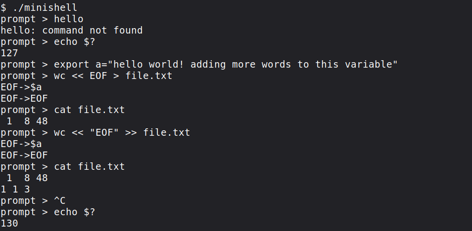
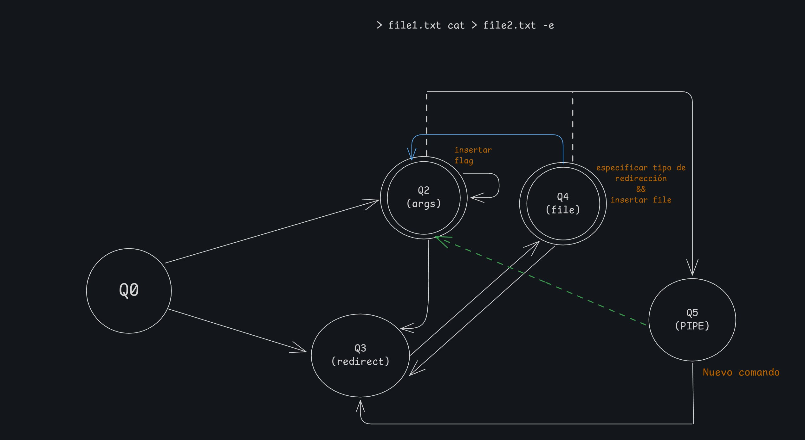

<p align="center">
  
</p>



# minishell

A Bash-like shell written in C for Linux, built as a pair project at
[42 Madrid](https://www.42madrid.com/) with
[Paolo Sapio](https://github.com/paolosapio).

## Features

- Interactive prompt with history (GNU readline)
- Pipes (`|`) and redirections (`<`, `>`, `>>`, `<<` heredoc)
- Quote handling (`'...'`, `"..."`) and environment variable expansion
  (`$VAR`, `$?`, `$$`)
- Built-ins: `echo`, `cd`, `pwd`, `export`, `unset`, `env`, `exit`
- Bash-compatible exit codes (`126`, `127`, `128+signal`) and signal handling
  (`Ctrl-C`, `Ctrl-D`, `Ctrl-\`)
- A few easter eggs. Try `kermit`, `pepe` or `version`.

## How it works

Every line goes through the same pipeline:

**readline → quote check → tokenizer → token cleanup → automaton → executor**

1. **Tokenizer.** Splits the line into typed tokens (word, env variable,
   redirections, pipe, space, quotes) and expands variables as it goes.
2. **Token cleanup.** Merges adjacent words (`"a"b` becomes one argument) and
   splits a variable that expands to several words into separate arguments.
3. **Finite-state automaton.** Consumes the tokens one by one through a
   transition matrix of 6 states. It rejects invalid syntax (for example `| |`
   or a redirection with no target) and, for each valid token, calls the
   function that fills in the command list: arguments, redirections, and the
   end of each command at a pipe.



4. **Executor.** A single built-in without pipes runs in the parent process
   (so `cd`, `export` and `exit` affect the shell itself) with its file
   descriptors saved and restored. Everything else is forked: one child per
   command, connected by pipes with `dup2`, binaries resolved through `PATH`,
   and the exit status taken from the last process in the pipeline.

### Details

- **Heredocs** are read in a child process before execution and written to a
  temporary file, so `Ctrl-C` cancels them without killing the shell. Quoting
  the delimiter disables expansion, as in Bash.
- **Signals.** The shell, its children and the heredoc each install their own
  handler. A single global variable stores the last exit status so handlers can
  update `$?`.
- **`$$`** is implemented by reading `/proc/self/stat`.
- **Environment** is copied into a linked list, so `export` and `unset` never
  touch the original `environ`.

## Build and run

Requires `cc`, `make` and the readline library (`libreadline-dev` on Debian/Ubuntu).

```bash
git clone https://github.com/anfipatica/minishell.git
cd minishell
make
./minishell
```

`make clean`, `make fclean` and `make re` are also available.

## Project layout

| Path | Contents |
|---|---|
| `srcs/tokenizer.c`, `ifereitor.c`, `expandetor.c` | Tokenization and expansion |
| `srcs/automata.c`, `automata_func.c` | State machine and the functions it triggers |
| `srcs/executor*.c`, `srcs/pepex/` | Execution, pipes, `PATH` lookup, heredoc |
| `srcs/built-ins/` | Built-in commands |
| `srcs/list_functions/` | Linked lists for tokens, commands, args, env |
| `libft/` | Our own C library |

## Authors

- [Yolanda Muñoz](https://github.com/anfipatica)
- [Paolo Sapio](https://github.com/paolosapio)

